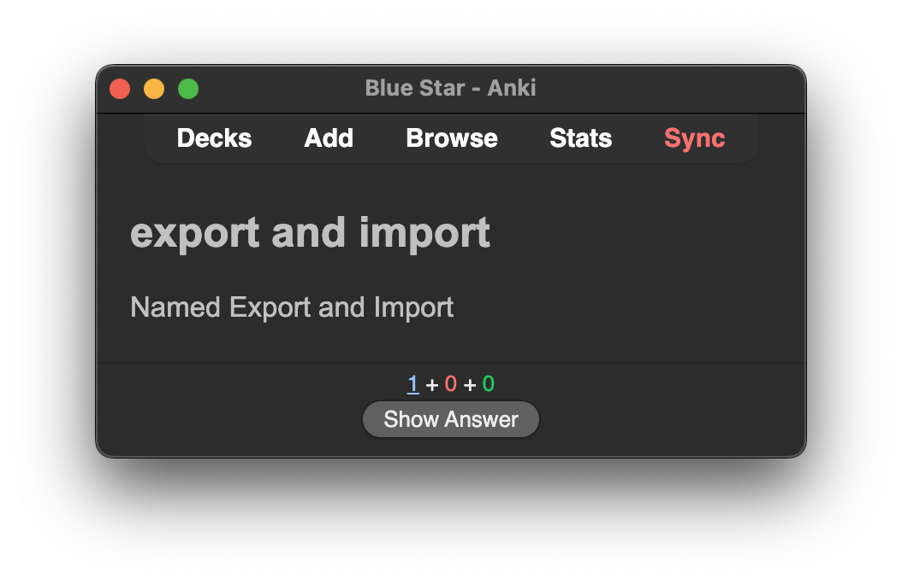
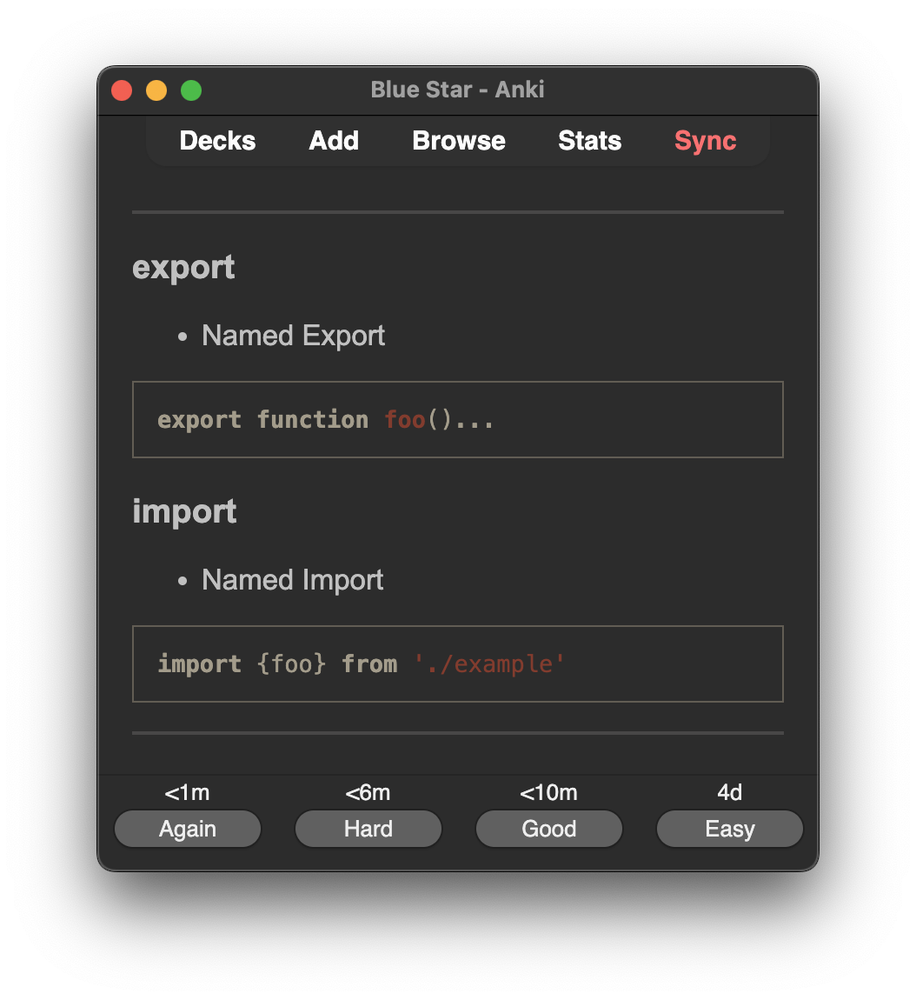
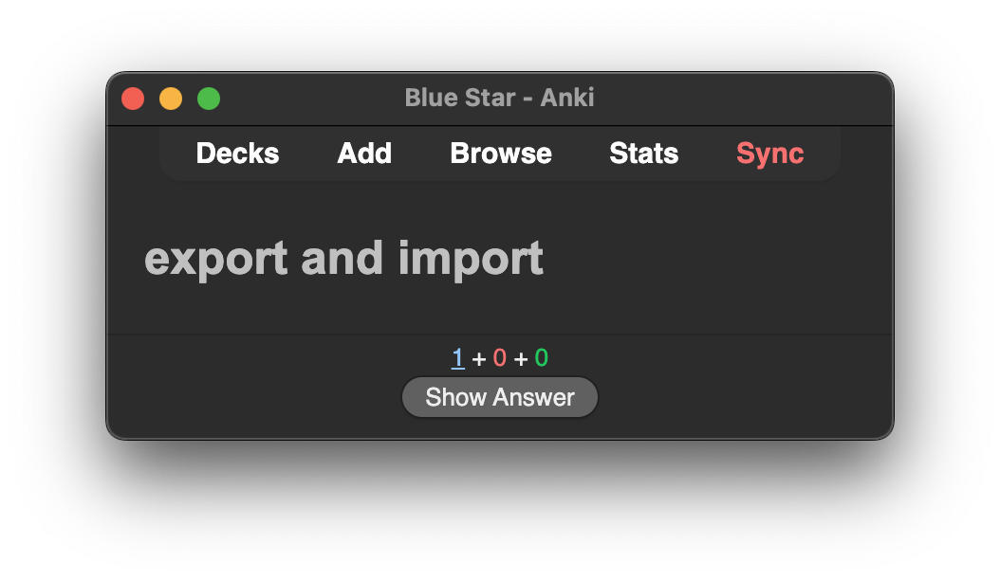
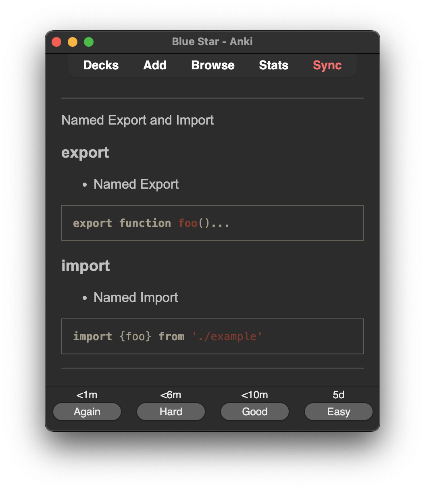
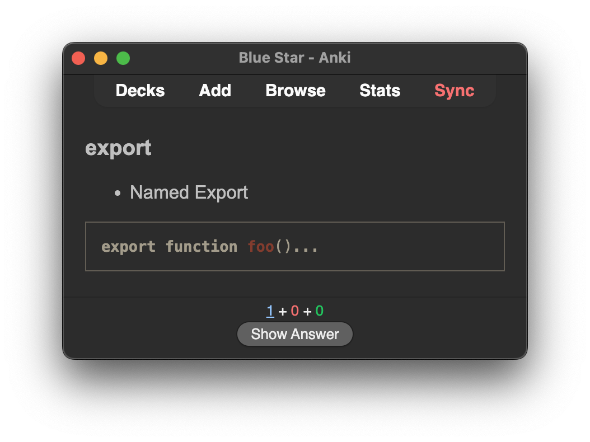
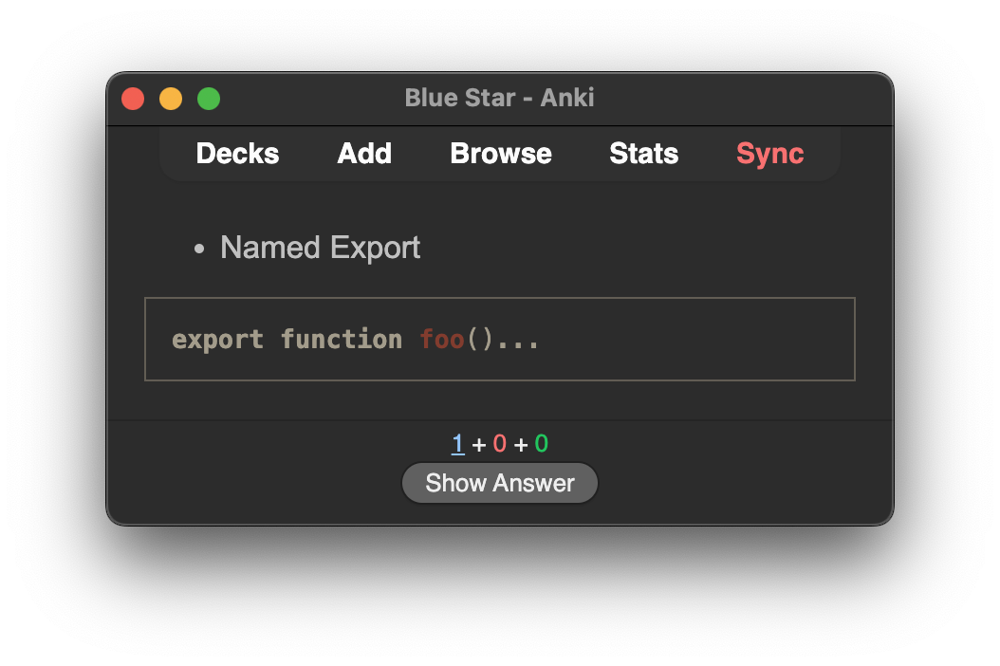
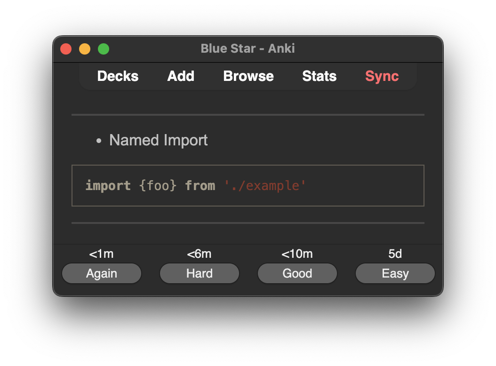

# Blue Star: Effortlessly Transform Your Obsidian Notes into Anki Flashcards

Blue Star is an Obsidian plugin that simplifies the process of creating Anki flashcards from your notes. With a variety of built-in parsing modes and customization options, Blue Star empowers you to efficiently turn your knowledge into memorable study material.

## Features

* **Multiple Parsing Modes:** Choose from pre-defined modes based on headings, sections, or custom delimiters. Craft powerful flashcards using regular expressions for advanced control.
* **Directory and Tag Filtering:** Generate flashcards from specific directories or files tagged with particular keywords, enabling focused learning.
* **Granular Control:**  Decide whether to add new cards only or update existing ones in Anki. Configure default decks, models, and tags for seamless workflow integration.
* **Document-Level Settings:** Fine-tune card creation behavior within individual notes. Override default settings for ultimate flexibility.
* **User-Friendly Interface:**  A dedicated ribbon icon and command palette command provide quick access to card generation.
* **Intuitive Setup:** Clear instructions guide you through the initial AnkiConnect configuration.

## Installation

1. In Obsidian, go to `Settings` -> `Community plugins`.
2. Click `Browse` and search for "Blue Star".
3. Click `Install` and then `Enable` to activate the plugin.

## Getting Started

### 1. Install AnkiConnect

Blue Star requires the AnkiConnect plugin for communication with Anki. 

* Search for AnkiConnect (code: 2055492159) in Anki's Add-ons menu.
* After installation, restart Anki.
* **Optional but Recommended:** Install a Markdown plugin in Anki (e.g., "Markdown and KaTeX", code: 1786114227) for enhanced card display.

 If the connection fails, check the AnkiConnect configuration as follows:
```
{
    "apiKey": null,
    "apiLogPath": null,
    "ignoreOriginList": [],
    "webBindAddress": "127.0.0.1",
    "webBindPort": 8765,
    "webCorsOrigin": "http://localhost",
    "webCorsOriginList": [
        "http://localhost",
        "app://obsidian.md"
    ]
}
```

### 2. Configure Blue Star

* Access Blue Star's settings in Obsidian's plugin settings.
* Configure your preferred parsing mode, default Anki settings, and other options.

### 3. Generate Flashcards

1. Open a note or navigate to a directory containing the content you want to convert.
2. Click the Blue Star icon in the ribbon or use the command `Blue Star: Create Anki cards`.
3. Monitor the progress notifications in Obsidian's status bar.

## Parsing Modes

Blue Star offers the following parsing modes:

* **Section :: Subsection:** Creates two-field cards from headings and their immediate subheadings.
* **Heading :: Paragraph:**  Generates two-field cards from headings and their corresponding content blocks.
* **Multi-Subsection:**  Produces multi-field cards by extracting content from all subheadings under a main heading.
* **Multi-Subparagraph:** Creates multi-field cards by dividing content under a heading into separate fields based on paragraphs.
* **Regex:**  Empowers you to define custom card and field extraction rules using regular expressions.
* **Custom Delimiter:**  Allows you to specify unique start, end, and field separator strings for card generation.

Below is an example text demonstrating the built-in generation modes (The setting for heading level is 2):

``````
# Example

## export and import
Named Export and Import

### export
- Named Export
```js
export function foo()...
```

### import
- Named Import
```js
import {foo} from './example'
```
``````

### Section :: Subsection

Generates cards with 2 fields based on heading and subheading blocks. Example card:  

**Front:**
<div>  </div>
**Back:**
<div>  </div>

### Heading :: Paragraph

Generates cards with 2 fields based on heading and the content block under the heading. Example card:  

**Front:**
<div>  </div>
**Back:**
<div>  </div>

### Multi-Subsection

Generates cards with multiple fields based on each subheading block under a heading. Example card:  

**Front:**
<div>  </div>
**Back:**
<div>  </div>

### Multi-Subparagraph

Generates cards with multiple fields based on each content block under a heading. Example card:  

**Front:**
<div>  </div>
**Back:***
<div>  </div>

### Custom delimiter

Generates cards based on custom start, field separator, and end delimiters. 

**Note**:

```
# Example

<!-- card start -->
Custom Delimiter Card Front
<!-- field separator -->
Custom Delimiter Card Back
<!-- card end -->
```

**Front:**
<div>  </div>
**Back:**
<div>  </div>

### Regex

Generates cards based on regular expressions. If you create a useful regex, please share it on the plugin's GitHub page. Many thanks!

If you are not familiar with writing regular expressions (don't worry, neither am I), the Obsidian_2_Anki plugin provides some useful regex patterns. You can find them on its introduction page, which also includes usage examples. Many thanks to Obsidian_2_Anki.

When using regex patterns from Obsidian_2_Anki with this plugin, set the regex flags to `gm`. Obsidian_2_Anki regex introduction page: [Regex](https://github.com/ObsidianToAnki/Obsidian_to_Anki/wiki/Regex)

## Document-Level Configuration

You can configure Anki card generation for a specific document. Document-level settings override the default settings. You don't need to configure all options; only the ones specified in the document block will override the defaults. 

Customize card creation for individual notes using code blocks with the following format:

``````
```anki
deck: YourDeckName
model: YourModelName
tag: YourTagName
parser: section-subsection 
```
``````

**Available options:**

* `deck` / `anki-deck`
* `model` / `anki-model`
* `tag` / `anki-tag`
* `parser` / `match` / `match-model` (Options: `section-subsection`, `heading-paragraph`, `multi-subsection`, `multi-suparagraph`, `regex`, `custom-delimiter`)
* `regex`
* `flags` / `regex-flag` / `flag` / `regex-flags`
* `heading` / `heading-level`
* `update` / `upsert` (Values: `true` or `false`)
* `single` / `single-field` (Values: `true` or `false`)
* `card-start`
* `field-separator` / `field-split` / `field`
* `card-end`

## Support and Feedback

Encountered an issue or have a suggestion? Please open an issue on the [GitHub repository](https://github.com/Lio5n/blue-star). 
